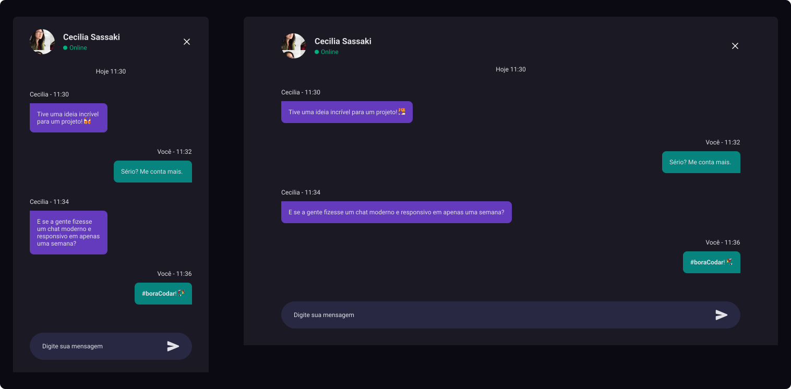

<h1 align="center"> Uchat </h1>

Responsive chat for desktop or mobile

<a href="https://luminous-strudel-76439d.netlify.app/">
  Click here or on the image above to access the project page
</a>

---

## How to develop it

- Clone this repositorty by using `git clone git@github.com:jairo-sousa/boracodar-4-chat`
- Navigate into the main directory `cd <diname>`
- Run `npm install` to install node modules
- Run `npm run dev` to run it locally then will open on your browser on `localhost:5173`  
  \*port value may vary
- Run `npm run build` if you want to create a production build

## Technologies

Project developed with the following technologies:

- React Js
- Typescript
- Chackra UI
- Git and Github

## Project

Weekly challenge [#boracodar](https://boracodar.dev/) proposed by [rocketseat](https://www.rocketseat.com.br/)

#4 - Responsive chat for desktop or mobile

A simple responsive chat

## Layout

You can view the project layout through [THIS LINK](https://www.figma.com/community/file/1200070743637495660). You must have a [FIGMA](https://www.figma.com/) account to edit it.

---

Created by [Jairo Sousa](https://github.com/jairo-sousa)
